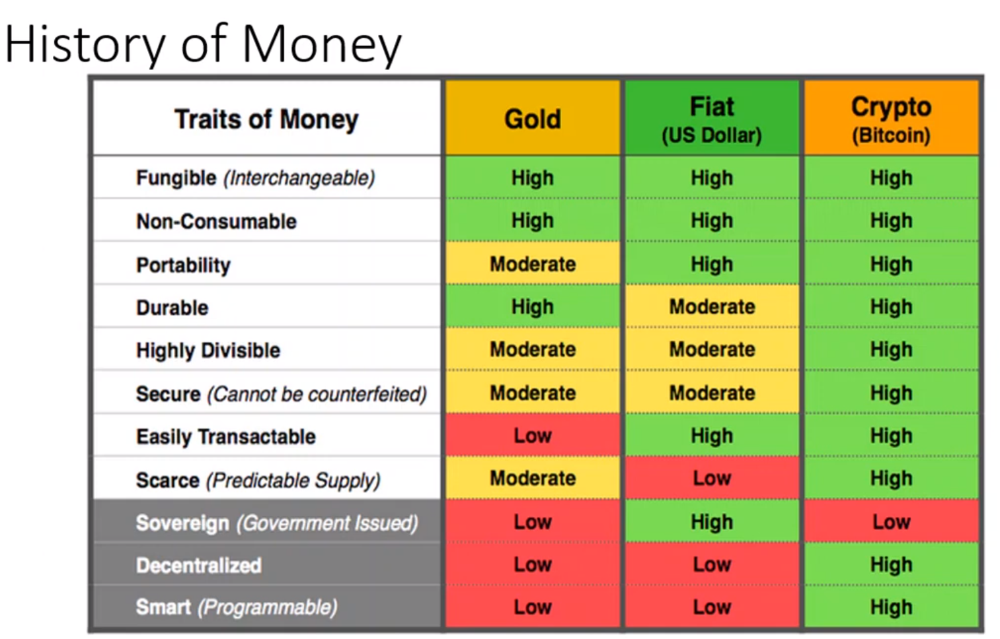

# Money

Three properties of money. It is a

1. Medium of exchange
2. Store of value
3. Unit of account

##### Medium of exhanges

- Can exchange good or services.
- Money become something that every one desires.
- Evetyone can focus on strength and skills to earn and get whatever he/she will.

  1. Scarcity
  2. Durable - foldable 8000 times.
  3. Trusted by peoply / Widely accepted
  4. Fungible
  5. Portable
  6. Divisible
  7. Hard to counterfeit

###### Store of value

A store of value is any commodity or asset that would normally retain purchasing power into the future and is the function of the asset that can be saved, retrieved and exchanged at a later time, and be predictably useful when retrieved.

- Not like bolvia currency which lost its purachasing power by half every 24 hrs.

###### Unit of account

Standard numeeial monetry unit of measurement of market value of goods, servies and other transactions.

### Difference b/w currency, wealth and income?

Currency - notes or coins which are available to you.

Wealth - assets, bank balance, property, car, bonds, stocks and share etc. United states categoried cryptocurrent as assets/capital.

Income - flow of money wrt of time.

- Income does not means that same amount of wealth you would possess.

Important point

- Scarcity -
- Soveriegn - As gold is not backed by govt, people place their trust in it so it evergreen mode of exchange.
- Programmable - If i give my son 10 bitcoin I can manage.program in what good or servies they can be sued.

If I pay taxes to govt bitcoin, I can program my tax like it can only be used in public welfare not in war.
